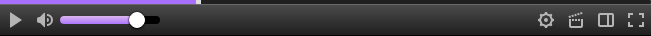

<h1 align="center">Twitch HTML5 Player <kbd>1.0dev1</kbd></h1>

Try to recreate the old Twitch player.

## Screenshots.

  
  
Base player + VOD progress bar.

## How to work.
1. [Download Tampermonkey](https://www.tampermonkey.net/)
2. Install the script [here](https://github.com/ktg5/Twitch-HTML5-Player/raw/dev/Twitch-HTML5-Player.user.js)